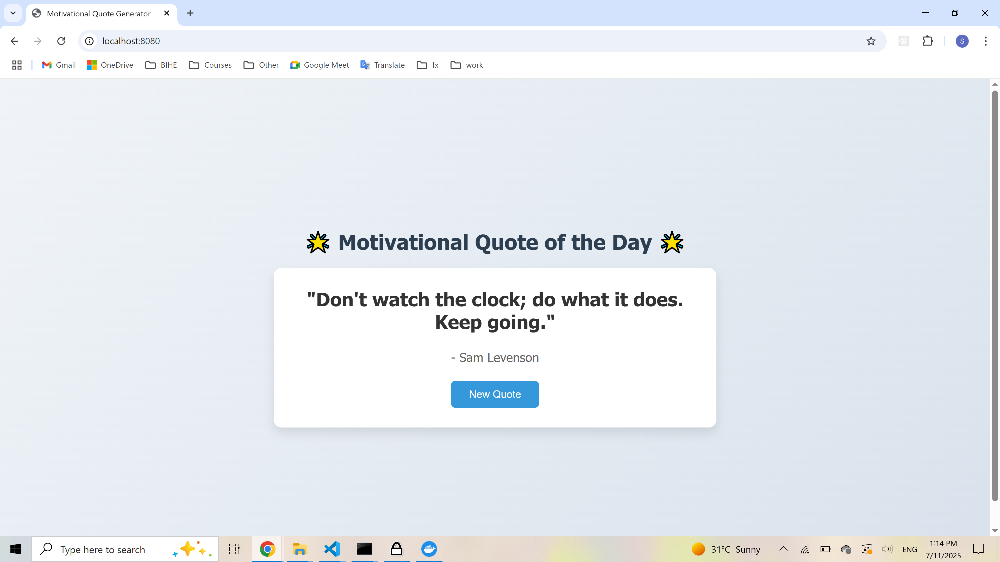

## Project Description

This web app is a simple motivational quote generator that displays a new inspirational quote each time the page is loaded or the user clicks the "New Quote" button. It features a collection of 20 uplifting quotes from various authors to encourage positivity and motivation. I chose this idea because everyone can benefit from a little daily inspiration, and it was a great way to practice building a lightweight, interactive web application with Docker.

## Why I chose Nginx as the base image

I chose **Nginx** as the base image for my web application because it is a lightweight, high-performance web server that efficiently serves static content like HTML, CSS, and JavaScript. Nginx uses an event-driven, asynchronous architecture which allows it to handle many simultaneous connections with low memory usage, making it ideal for fast and scalable web apps. Additionally, Nginx is easy to configure and widely used in production environments, ensuring reliability and security for my Docker container.

## A screenshot of my web page running in the browser

